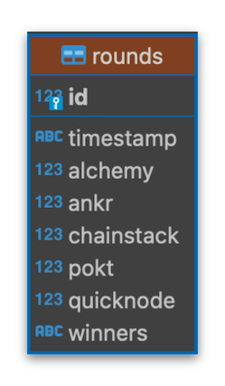

# Solana Block Derby 🏇🏻

A script to fetch Solana blockchain's latest slot number using various blockchain node providers, compare them, and compute the winner.

(Optional) The data can also be sent to a Posgtres DB for querying later.

### Current Providers

- Alchemy
- Ankr
- Chainstack
- Pokt Network
- QuickNode

## Screenshot


## Run

1. Clone the project

```bash
  git clone https://github.com/a26nine/sol-block-derby
```

2. Go to the project directory

```bash
  cd sol-block-derby
```

3. Install dependencies

```bash
  npm install
```

4. Set configuration and environment vairables (as shared below)

5. Start the server

```bash
  npm start
```

## Configuration

- `timeoutSeconds` - Timeout for the RPC request
- `intervalSeconds` - Time interval between the rounds
- `isDb` - Setting to enable/disable the database operations
- `tableName` - Postgres database table name

## Environment Variables

To run this project, you will need to add the following environment variables to your `.env` file (sample in `.env.example` file)

- `ALCHEMY_ENDPOINT=`
- `ANKR_ENDPOINT=`
- `CHAINSTACK_ENDPOINT=`
- `POKT_ENDPOINT=`
- `QUICKNODE_ENDPOINT=`

_If you want to push the results to a Postgres Database and if `isDb` is set to true_

- `PGDATABASE=`
- `PGHOST=`
- `PGPASSWORD=`
- `PGPORT=`
- `PGUSER=`

_If you are running the script from multiple servers/locations and want to have individual tables_

- `DB_SUFFIX=`

## Query Database

You can run Various SQL queries provided in `sql/queries` against the database.


